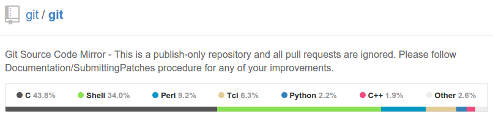

A directory of tools commonly used by web developers

At the moment, this is just a jumble of `.json` files. But the idea is that this will be imported into a database and an application will be written to search through it. The end result is one where if a developer is confused about what something (anything - libraries, tools, programs) is, they can just do a search and be provided with a description and use cases.

# Collection Schema

## Tools

* **_id** *String* - A unique name amongst all the documents - usually the lowercaseCamelCase, space-removed version of the name will do. E.g. express
* **name** *String* - The human-readable name of the tool
* **dependencies** *Array of Strings* - An array of strings with the strings being valid `id` of another document. E.g. ["express", "nodejs"]
* **language** *String* - Which language is this tool primarily being written in? Must be a valid `id` value from the `Languages` collection
* **environments** *Array of Strings* - Which environment is this tool used in? (valid values below)
* **audience** *Array of Strings* - Who would use this tool? (valid values below)
* **description** *String* - A short description of the tool, aim to keep it within 20 words or 120 characters
* **features** *Array of Strings* - An array listing out features of the tool
* **scenario** *Array of Strings* - An array listing out the use cases or scenarios where a person would use this tool
* **website** *String* - The URL to the official site, without the protocol
* **repository** *String* - URL to the repository
* **demo** *String* - URL to a demo, if any
* **similar** *Array of Objects* - Each object shall represent a similar tool, and have the properties `id` and `relationship`, where `id` is the name of 
		{
			id: "grunt",
			relationship: "Gulp has a simpler syntax to Grunt"
		}
* **used by** *Array of Strings* - An array of the organization `id`s, as specified in the Organizations collection (below)
}

## Organizations

* **_id** *String* - A unique name amongst all the organizations - usually the lowercaseCamelCase, space-removed version of the name will do. E.g. joyent
* **name** *String* - The official and human-readable name of the organization. e.g. "Joyent, Inc."
* **social** *Object* - Has the structure:

	{
		twitter: "handle",
		facebook: "username",
		github: "username"
	}

* **website** *String* - A link to the official website

## Languages

* **_id** *String* - A unique name amongst all the languages - usually the lowercaseCamelCase, space-removed version of the name will do. E.g. cnet
* **name** *String* - The official and human-readable name of the language - e.g. "C#.NET"

# Valid Values

## Audience

* sysadmin
* backend
* frontend
* designer
* manager
* qa

## Environments

* browser
* server
* client
* android
* ios
* mobile
* windows
* linux
* osx

# Notes

## Languages

The primary language the platform or tool is written in. If there are more than one, pick the one which is used most often. For example, for Git, 43.8% of the code base is written in C, while 34.0% in Shell. So you'd classify git's 'language' property as 'c'.

If you are unsure, leave it blank (`""`).